<div class="slide-header" style="display:flex;  gap:10px;">
  
  <h2>Shiny can feel boring</h2> 
</div>


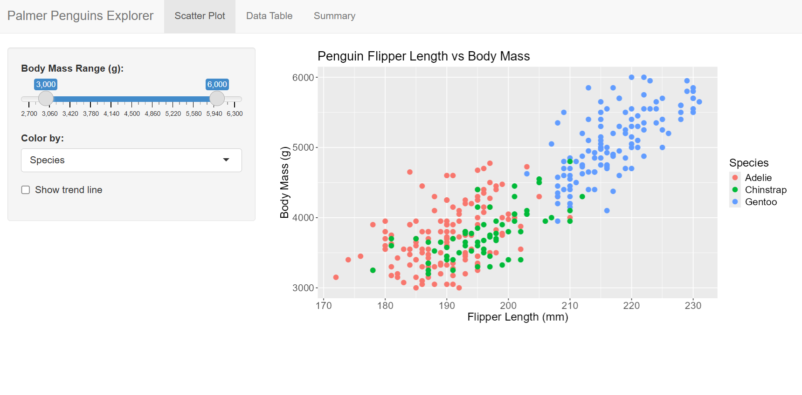{.round .absolute top="13%" left="50%" width="115%" style="transform: translateX(-50%); max-width: none; max-height: none;"}

---

## Web Design Basics

But before we can make Shiny look nice, we need to understand the basics of web design...


{.round fig-align="center"}

---

<!-- Web Design  -->

:::: {.layout-ncol=3}

::: {.column .small width="33%"}

[HTML ]{.column-header}

- *HyperText Markup Language*
- The skeleton of the web
- Blueprints for structuring content

:::

::: {.column .small width="33%" }

[CSS  ]{.column-header}

- *Cascading Style Sheets*
- The style of the web (colors, fonts, etc.)
- Helps us make things look nice and pretty

:::

::: {.column .small width="33%" }

[JS ]{.column-header style="vertical-align: bottom;"}

- *JavasScript*
- The interactivity of the web
- Makes things move and respond to user actions

:::

::::


---

### HTML and CSS Basics


:::: {.columns}
::: {.column width="25%"}

[HTML ]{.column-header}

- `<div>`
- `<title>`
- `<p>` 
- `<h1>`
- ``

:::
::: {.column width="25%"}

[CSS  ]{.column-header}

- background
- padding
- border-radius
- font-size

:::
::::

{.round .absolute top=100 right=-120 width=60%}

---

### HTML Tags 

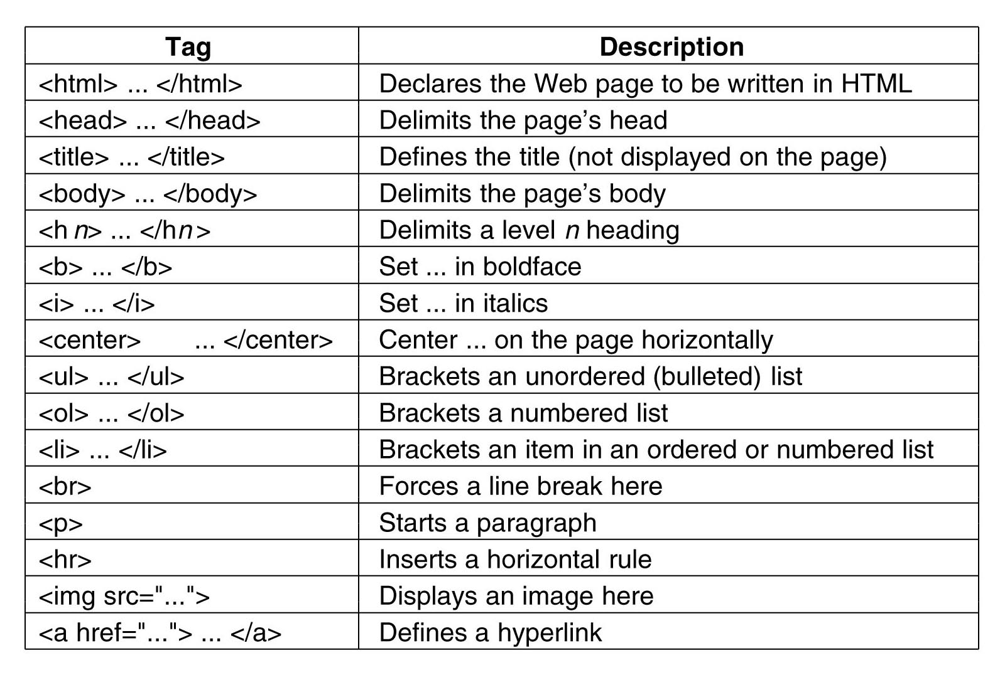{.round width=50% fig-align="center"}

---

### Basic Box

```{.html}
<div style="background: red; padding: 1rem; 
      border-radius: 12px; width:20%;">
<div style="background: blue; padding: 6px 10px;">
<p style="font-size: 20px; font-style: italic; 
      text-decoration: underline; background: transparent;">
      HTML and CSS</p>
</div>
</div>
```
<br>
<div style="background: red; padding: 1rem; border-radius: 12px; width:20%;">
<div style="background: blue; padding: 6px 10px;">
<p style="font-size: 20px; font-style: italic; text-decoration: underline; background: transparent;">HTML and CSS</p>
</div>
</div>

---

### Basic box with image 

```{.html}
<div style="border: 4px solid red; border-radius:12px; 
      padding:1rem; width:25%; margin:0.5rem auto;">

<p>Sablefish</p>
</div>

```


<div style="border: 4px solid red; border-radius:12px; padding:1rem; 
      width:25%; margin:0.5rem auto;">

<p>Sablefish</p>
</div>

----


[Fortunately we don't need to do this *all* by hand]{.center} 

{style="width: 15%; height: auto; display: block; margin: 0 auto;"}


::::{.columns}
::: {.column width="50%"}
  - Shiny uses wrappers around `HTML`, `CSS`, and `JS` 
  - Uses **`bootstrap 3`** for styling (CSS framework with pre-designed styles)
:::
::::


{.round .absolute top=275 right=-200 width="700" height="auto"}

---

But Shiny's default styling can feel a bit dated...

<br>

### How can we *avoid* writing excessive HTML and CSS?

{.round fig-align="center" width=80%}

---

### `{bslib}` provides an easy solution

{style="width: 20%; height: auto; display: block; margin: 0 auto;"}

- Founded on modern `bootstrap 5`
- 20+ pre-built themes (e.g. `flatly`, `minty`, `darkly`)
- Easily customize colors, fonts, and other design elements 
- Consolidates design process

---

:::: {.columns}
::: {.column width="50%"}

{.column-header style="width: 25%; height: auto; display: block; margin: 0 auto;"}

- bootstrap 3 (*older*)
- limited styling options
- css required for more customization


:::
::: {.column width="50%"}
{.column-header style="width: 25%; height: auto; display: block; margin: 0 auto;"}

- bootstrap 5 (*newer*)
- high flexibility
- `bs_theme()` for pre-built or custom themes
- card based layout 

:::
:::: 

---

[*Same structure, new functions*]{.center} 

:::: {.columns}
::: {.column width="50%"}

{.column-header style="width: 25%; height: auto; display: block; margin: 0 auto;"}

- `fluidPage()` 
- `navbarPage()` 
- `tabsetPanel()`


:::
::: {.column width="50%"}
{.column-header style="width: 25%; height: auto; display: block; margin: 0 auto;"}

- `page_fluid()`
- `page_navbar()`
- `page_sidebar()`
- more
    - `card()`, `value_box()`, `alert()`

:::
::::


---

{.round .absolute top="-5%" left="50%" width="125%" style="transform: translateX(-50%); max-width: none; max-height: none;"}


{.absolute left=-5% bottom=14% width=10%}


[`navbarPage()` `tabPanel()` `sidebarLayout()`]{.absolute left=-10% bottom=2%}

----

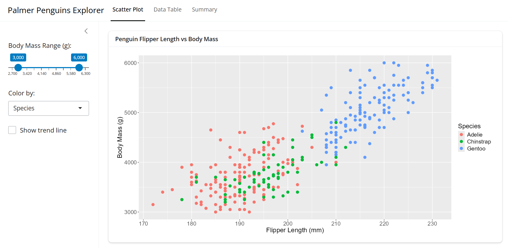{.round .absolute top="-5%" left="50%" width="125%" style="transform: translateX(-50%); max-width: none; max-height: none;"}


{.absolute left=-5% bottom=14% width=10%}


[`page_navbar()`, `nav_panel()`, `layout_sidebar()`]{.absolute left=-10% bottom=2%}


---

[Looks *better*, but still a bit bland]{.center} 

[Let's try using one of the pre-built themes, `minty`]{.center} 

```{.r filename="ui.R" code-line-numbers="4-7"}
ui <- page_navbar(
  title = "Palmer Penguins Explorer",

  # adding custom bslib theme
  theme = bslib::bs_theme(
    bootswatch = "minty" # adding a pre-built theme
  )
  # ... Other UI code...
)
```

---

[We are getting there!]{.center} 

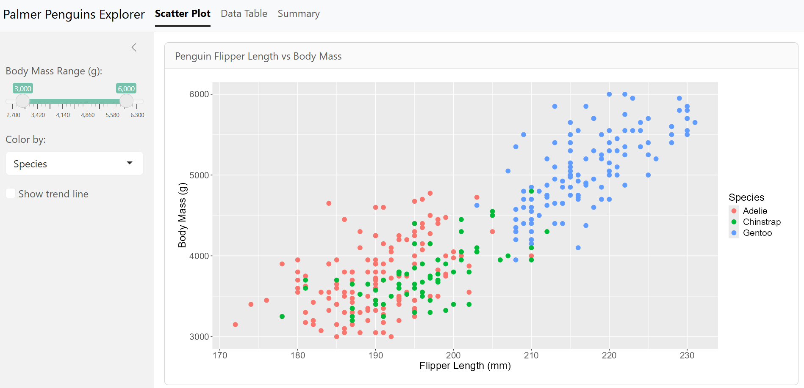{.round .absolute top="10%" left="50%" width="115%" style="transform: translateX(-50%); max-width: none; max-height: none;"}

---

[Lets add some custom theme on top of `minty`]{.center} 


```{.r filename="ui.R" code-line-numbers="4-17"}
ui <- page_navbar(
  title = "Palmer Penguins Explorer",

  # adding custom bslib theme
  theme = bslib::bs_theme(
    bootswatch = "minty", # start with a pre-built theme
    fg = "#293f2fff", # change foreground color
    bg = "#e5f2fcff", # change background color
    primary = "#2f99a7ff", # accents
    base_font = font_google("Roboto"), # fonts
    heading_font = font_google("Pacifico") # fonts
  ),

  navbar_options = bslib::navbar_options(
    bg = "#021d31ff") # set navigation bar bg color
  # ... Other UI code...
)

```

---

Looking better, but the `ggplot` looks off

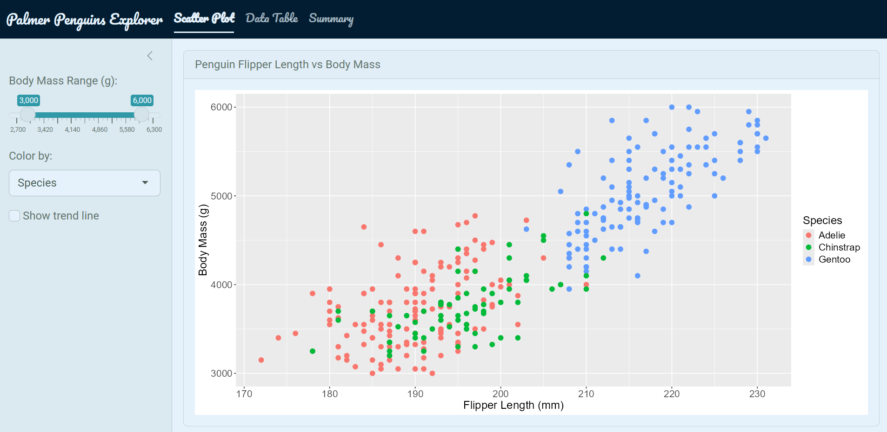{.round .absolute top="10%" left="50%" width="115%" style="transform: translateX(-50%); max-width: none; max-height: none;"}


---

<div class="slide-header" style="display:flex;  gap:10px;">
  
  <p class="s-title">dynamic ggplot theme</p> 
</div>


```{.r filename="server.R" code-line-numbers="4"}

server <- function(input, output) {
  # ... Server code ...
  thematic::thematic_shiny(font = "auto") # themes ggplot to bslib
}

```


---

{.round .absolute top="-5%" left="50%" width="125%" style="transform: translateX(-50%); max-width: none; max-height: none;"}


# Icons, value boxes, and widgets

---

[{bsicons}, {fontawesome}, shiny::icon() ]{.s-title} 

[https://icons.getbootstrap.com/](https://icons.getbootstrap.com/){.center}

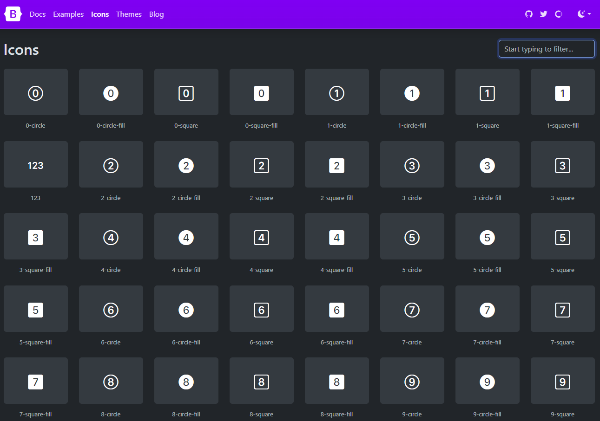{.round fig-align="center" width=100%}

---

[Value Box w/ Icon]{.s-title}

```{.r filename="ui.R"}
value_box(
  value = nrow(penguins),
  title = "Total Penguins",
  showcase = bsicons::bs_icon("hash"), # insert icon
  theme = "primary"
)
```
---

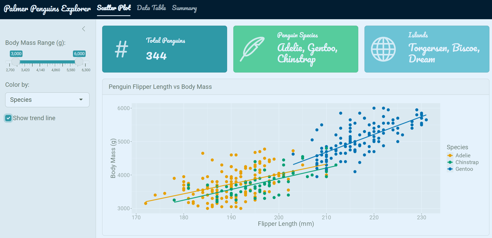{.round .absolute top="-5%" left="50%" width="125%" style="transform: translateX(-50%); max-width: none; max-height: none;"}

---

[`{shinyWidgets}` ]{.s-title} 

`shinyWidgets::shinyWidgetsGallery()` for full gallery

{.round fig-align="center"}

---

```{.r filename="ui.R" code-line-numbers="5"}
# ... UI Code ...
layout_sidebar(
      sidebar = sidebar(
        # ... Other sidebar code ...
shinyWidgets::pickerInput() # pretty widgets
))
  # ... Other UI code ...
```


---

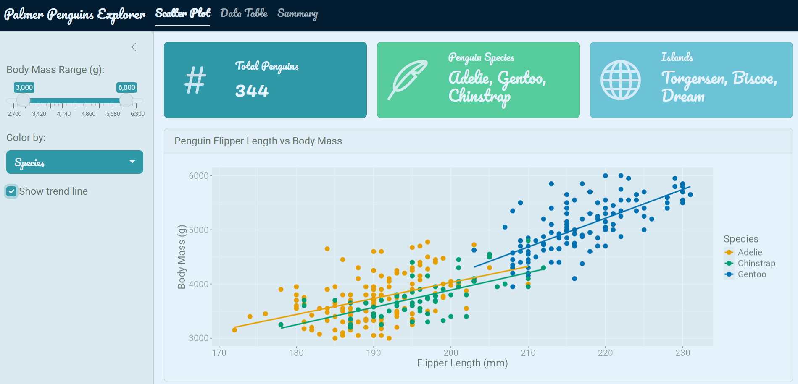{.round .absolute top="-5%" left="50%" width="125%" style="transform: translateX(-50%); max-width: none; max-height: none;"}


# Custom HTML and CSS

---


:::: {.columns}
::: {.column width="40%"}


- `tags$p()`
- `tags$div()`
- `tags$img()`
- `tags$h1()`
:::

::: {.column width="60%"}


Create custom HTML elements and CSS styles directly in R Shiny with `{htmltools}`

:::
::::

---

Add an image of a sablefish with label in app

```{.r filename="ui.R" code-line-numbers="4-15"}
layout_sidebar(
      sidebar = sidebar(
        # ... Other sidebar code ...
# image of a sablefish 
htmltools::tags$img(
  src = "sablefish.jpg", # adding sablefish image to sidebar
  width = "100%",
  style = "margin-top: 1rem; border-radius: 6px;" #CSS
)

# image text
htmltools::tags$p(
  "Sablefish are deep-sea fish found in the North Pacific, 
  known for their rich flavor and high oil content.",
  style = "color: teal; font-size: 0.8rem; font-style: italic;"
)))
# ... Other UI code ...
```

---

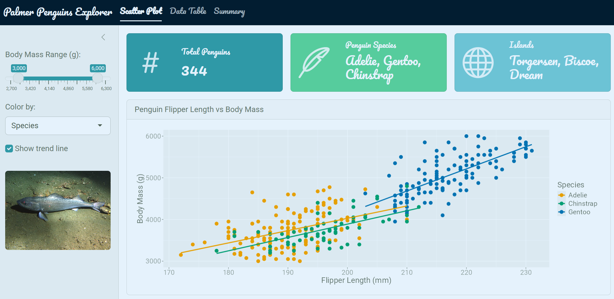{.round .absolute top="-5%" left="50%" width="125%" style="transform: translateX(-50%); max-width: none; max-height: none;"}


# CSS Heirarchy

---


1. Inline (Highest priority)

```{.r filename="ui.R"}
# 1. Inline
htmltools::tags$img(
  src = "sablefish.jpg",
  style = "margin-top: 1rem; border-radius: 6px;" #CSS
)
```

2. External (Lowest priority, but best practice)

```{.r filename="ui.R"}
# 2. External
tags$head(tags$link()) # calling an external CSS file out of app
```


---

## Linking external CSS file

```{.r filename="ui.R" code-line-numbers="7-12"}

ui <- page_navbar(
  title = "Palmer Penguins Explorer",
  theme = bs_theme(
    #... Theme code...
  ),

  # Linking extrnal CSS file
  tags$head(tags$link(
    rel = "stylesheet",
    type = "text/css", # type of file
    href = "styles.css" # file name
  )),
  # ...Other UI code...
)

```

---

<!-- 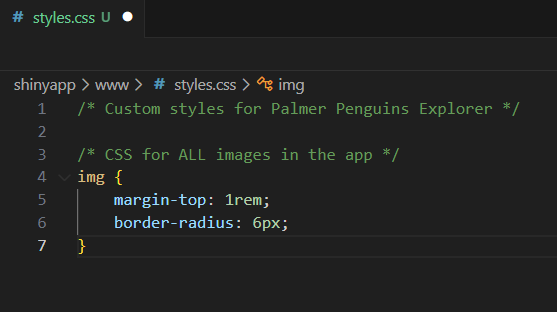{.round fig-align="center" width=100%}  -->

```{.r filename="ui.R"}
htmltools::tags$img(
  src = "sablefish.jpg",
  style = "margin-top: 1rem; border-radius: 6px;" #CSS
)
```

<div style="text-align: center;">
  
</div>


```{.css filename="styles.css"}
/* All images will have these styles applied  */

img {
  margin-top: 1rem;
  border-radius: 6px;
}
```


---

## Selector Types

1. [HTML Tag:]{.number-header} targets all *tag* elements of a specific type (`img`, `p`, `h1`, `div`).
2. [Class Selector:]{.number-header} targets elements with a specific *class* attribute (e.g., `.my-class`).
3. [ID Selector:]{.number-header} targets a single element with a specific *id* attribute (e.g., `#my-id`).


---

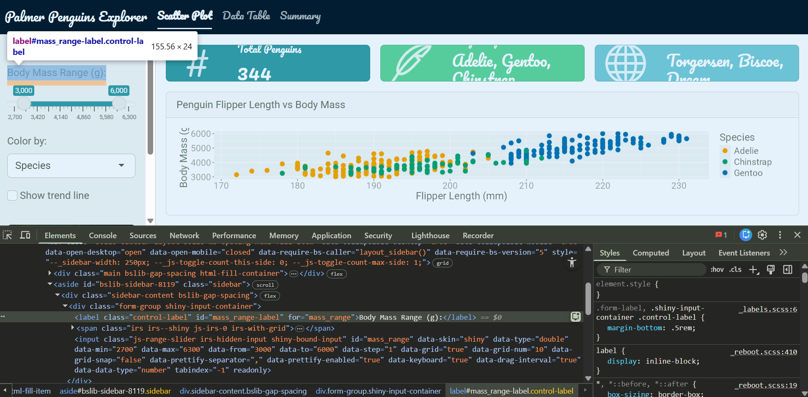{.round .absolute top="-5%" left="50%" width="125%" style="transform: translateX(-50%); max-width: none; max-height: none;"}

---

Targeting the [tag, class,]{.number-header} and [ID]{.number-header}

```{.css filename="styles.css"}
/* targeting HTML tag  */
img {
    border: #2f99a7ff solid 2px;
    border-radius: 8px;
    box-shadow: 0 4px 8px rgba(0, 0, 0, 0.2);
}

/* targeting HTML class .control-label */
.control-label {
    font-weight: bold; 
    color: #021d31ff; 
    text-decoration: underline; 
}

.card-header {
    background-color: #2f99a7ff;
    color: white;
    font-style: italic;
} 

/* targeting HTML id */
#mass_range-label {
    color: purple;
}
```
---

{.round .absolute top="-5%" left="50%" width="125%" style="transform: translateX(-50%); max-width: none; max-height: none;"}

---

## Approach

1. [~90%]{.number-header} `{bslib}` + packages: 
    - style big pictures 
    - theme, layout, icons, widgets
2. [~10%]{.number-header} HTML and CSS: 
    - fine-tuning  
    - specific elements

# Thank you 

[ https://github.com/ramhunte/shiny-aesthetics](https://github.com/ramhunte/shiny-aesthetics)

