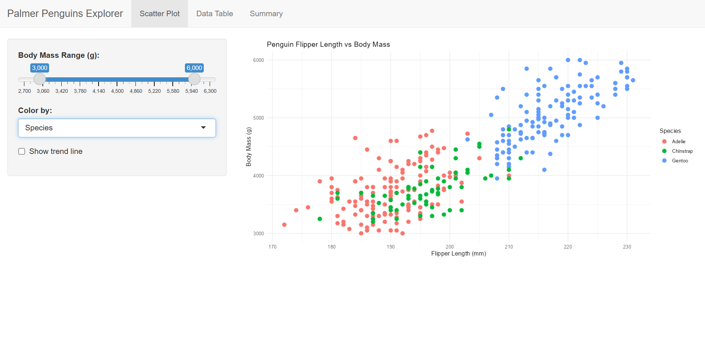
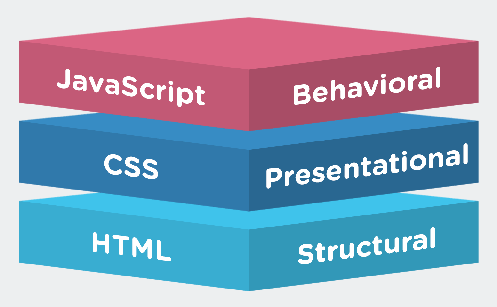
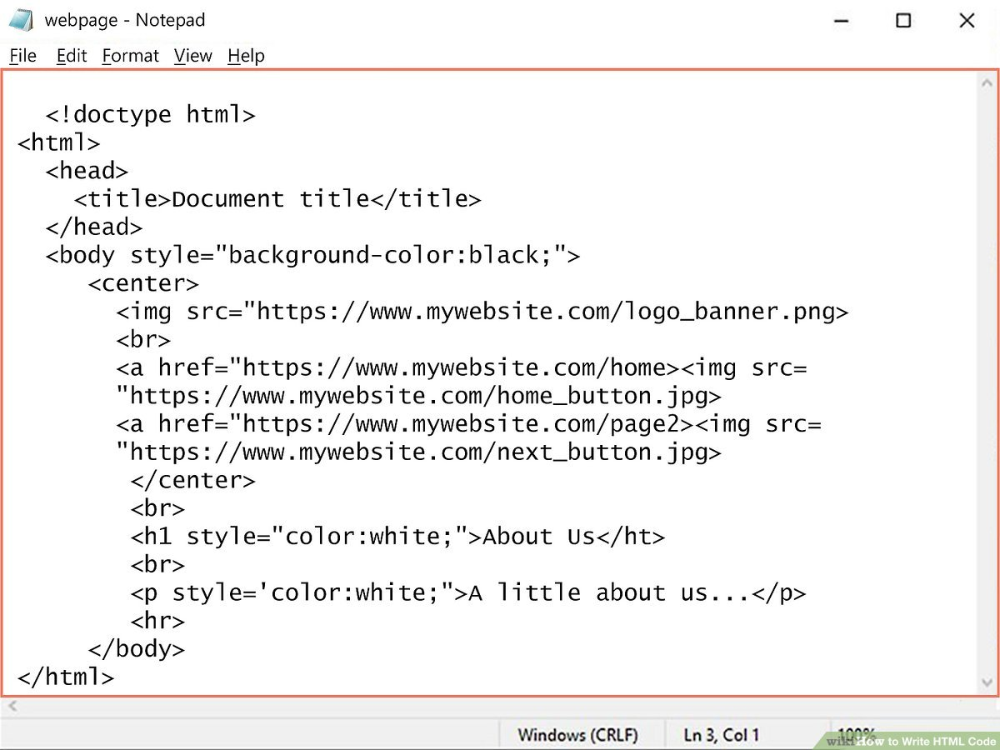
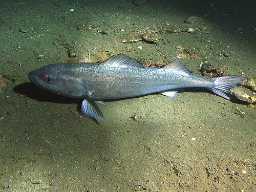
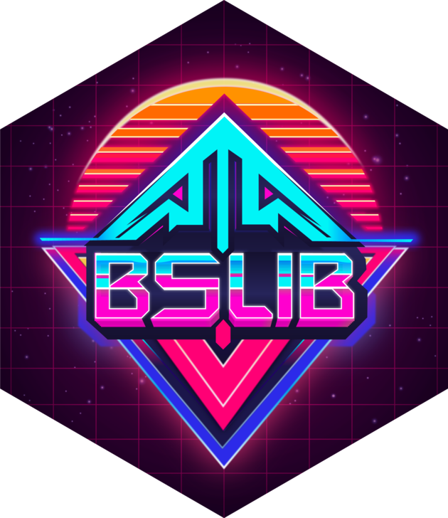
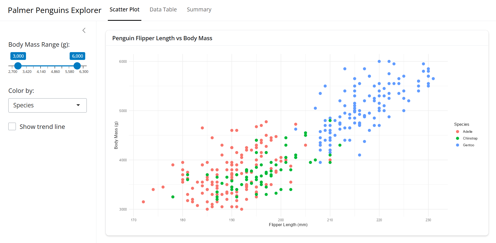
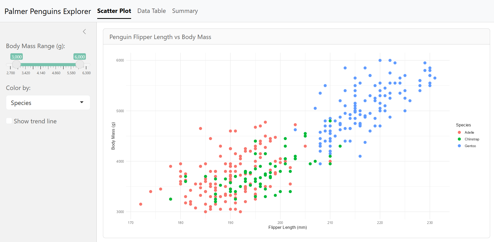
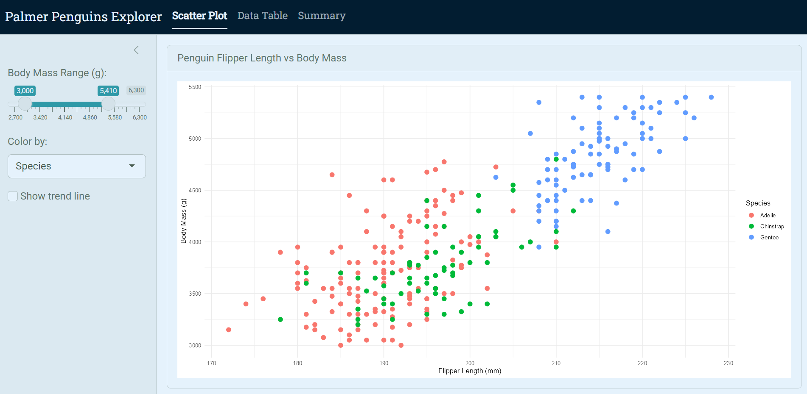

<div class="slide-header" style="display:flex;  gap:10px;">
  
  <p class="s-title">can feel boring...</p> 
</div>
<hr>



---

[But before we can make Shiny look nice, we need to understand the basics of web design...]{.center}

{width=40% }


---

<!-- Web Design  -->

:::: {.columns}
::: {.column width="33%"}

[HTML ]{.column-header}

- *HyperText Markup Language*
- The skeleton of the web
- Blueprints for structuring content

:::
::: {.column width="33%" }

[CSS  ]{.column-header}

- *Cascading Style Sheets*
- The style of the web (colors, fonts, etc.)
- Helps us make things look nice and pretty

:::
::: {.column width="33%" }

[JS ]{.column-header style="vertical-align: bottom;"}

- *JavasScript*
- The interactivity of the web
- Makes things move and respond to user actions

:::
::::

---

<div class="slide-header" style="display:flex;  gap:10px;">
  <p class="s-title">HTML and CSS Basics</p> 
</div>
<hr>

{.absolute top=150 right=-200 width="650" height="auto"}


:::: {.columns}
::: {.column width="25%"}

[HTML ]{.column-header}

- `<div>`
- `<title>`
- `<p>` 
- `<h1>`
- ``

:::
::: {.column width="25%"}

[CSS  ]{.column-header}

- background
- padding
- border-radius
- font-size

:::
::::


---

[Adding CSS to HTML]{.s-title} 

```{html, eval=FALSE, echo=TRUE}
<div style="background: #0b5ed7; padding: 16px; 
    border-radius: 12px; display: inline-block;">
<div style="background: #7fbfff; padding: 6px 10px; 
    border-radius: 8px; font-size: 20px; font-style: italic; 
    text-decoration: underline; color: #012a4a;">
<p>HTML and CSS</p>
</div>
</div>
```

<br>

<div style="background: #0b5ed7; padding: 16px; border-radius: 12px; display: inline-block;">
<div style="background: #7fbfff; padding: 6px 10px; border-radius: 8px; font-size: 20px; font-style: italic; text-decoration: underline; color: #012a4a;">
<p>HTML and CSS</p>
</div>
</div>

---

[Adding CSS to HTML]{.s-title} 

```{html, eval=FALSE, echo=TRUE}
<div style="display:flex; justify-content:center; align-items:center; 
  border:4px solid red; border-radius:12px; padding:1rem; 
  min-height:220px; width:30%; margin:0.25rem auto 0; box-sizing:border-box; 
  position:relative;">
  
    Sablefish
</div>

```


<div style="display:flex; justify-content:center; align-items:center; 
  border:4px solid red; border-radius:12px; padding:1rem; 
  min-height:220px; width:30%; margin:0.5rem auto 0; box-sizing:border-box; position:relative;">

    Sablefish
</div>

----


[Fortunately we don't need to do this *all* by hand]{.center} 

{style="width: 15%; height: auto; display: block; margin: 0 auto;"}


::::{.columns}
::: {.column width="50%"}
  - Shiny uses wrappers around HTML, CSS, and JS 
  - Uses **bootstrap 3** for styling (CSS framework with pre-designed components/styles)
:::
::::


{.absolute top=275 right=-200 width="700" height="auto"}

---

[But Shiny's default styling can feel a bit dated...]{.title}

---

[`{bslib}` provides an easy solution]{.center} 

{style="width: 20%; height: auto; display: block; margin: 0 auto;"}

- Founded on modern **boostrap 5**
- 20+ pre-built themes (e.g. `flatly`, `minty`, `darkly`)
- Easily customize colors, fonts, and other design elements 
- Consolidates design process

---

:::: {.columns}
::: {.column width="50%"}

{.column-header style="width: 25%; height: auto; display: block; margin: 0 auto;"}

- bootstrap 3 
- limited styling options
- css required for more customization


:::
::: {.column width="50%"}
{.column-header style="width: 25%; height: auto; display: block; margin: 0 auto;"}

- bootstrap 5
- high flexibility
- `bs_theme()` for pre-built or custom themes

:::
:::: 

---

[*Same structure, new functions*]{.center} 

:::: {.columns}
::: {.column width="50%"}

{.column-header style="width: 25%; height: auto; display: block; margin: 0 auto;"}

- `fluidPage()` 
- `navbarPage()` 
- `tabsetPanel()`


:::
::: {.column width="50%"}
{.column-header style="width: 25%; height: auto; display: block; margin: 0 auto;"}

- `page_fluid()`
- `page_navbar()`
- `page_sidebar()`
- more
    - `card()`, `value_box()`, `alrert()`

:::
::::


---

{fig-align="center" width=120% height="auto"}

:::: {.columns}
::: {.column width="25%"}

{fig-align="center" width=40%}

:::
::: {.column width="75%"}

`navbarPage()`, `tabPanel()`, `sidebarLayout()`

:::
::::

----

{fig-align="center" width=140%}

:::: {.columns}
::: {.column width="25%"}

{fig-align="center" width=40%}

:::
::: {.column width="75%"}

`page_navbar()`, `nav_panel()`, `layout_sidebar()`

:::
::::

---

[Looks *better*, but still a bit bland]{.center} 

[Let's try using one of the pre-built themes, `minty`]{.center} 

```{r}
#| code-line-numbers: "4-7"
#| eval: false
#| echo: true

ui <- page_navbar(
  title = "Palmer Penguins Explorer",

  # adding custom bslib theme
  theme = bs_theme(
    theme = "minty" # adding a pre-built theme
  )
  # ... Other UI code...
)
```

---

[We are getting there!]{.center} 

{fig-align="center" width=100%}

---

[Lets add some custom theme on top of `minty`]{.center} 

```{r}
#| code-line-numbers: "4-14"
#| eval: false
#| echo: true

ui <- page_navbar(
  title = "Palmer Penguins Explorer",

  # adding custom bslib theme
  theme = bs_theme(
    bootswatch = "minty", # start with a pre-built theme
    fg = "#293f2fff", # change foreground color
    bg = "#e5f2fcff", # change background color
    "navbar-bg" = "#021d31ff", # navbar background
    primary = "#2f99a7ff", # accents
    base_font = font_google("Roboto"), # fonts
    heading_font = font_google("Roboto Slab") # fonts
  )
  # ... Other UI code...
)
```

---

[Looking better]{.center} 

{fig-align="center" width=100%}


---

[bsicons]{.s-title} 

---

[fonts]{.s-title} 

---

[{thematic}]{.s-title} 


---

